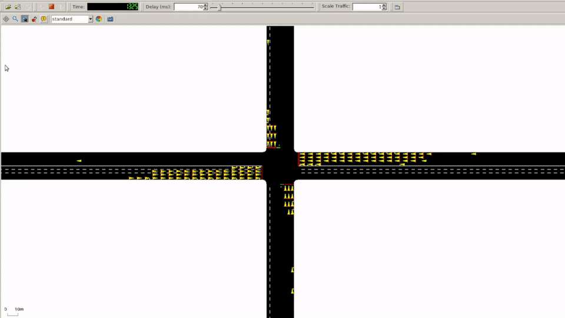
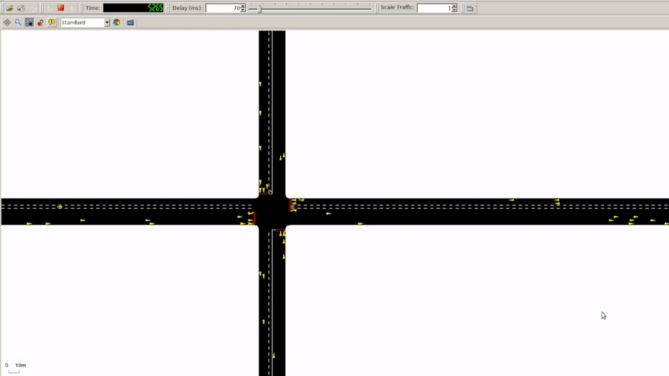

# Introduction
Given free reign to do a machine learning project in [ECE4179](https://handbook.monash.edu/2021/units/ECE4179){: target="_blank"} I grouped up with my old friend Chris and Kai who were both from Monash Motorsport. The unit taught at university was heavily based on machine learning for computer vision applications i.e. Convolutional Neural Networks (CNNs) and it was clear that doing vision based projects would not merit high marks, so we decided to investigate the field of __deep reinforcement learning__.

At first we thought of using reinforcement learning to train a bot for crypto trading given that there was heaps of volatility and thus potential gains, inspired by [Bruce Yang's project](https://towardsdatascience.com/deep-reinforcement-learning-for-automated-stock-trading-f1dad0126a02){: target="_blank"}. However, we were strongly advised against it as other students had previously tried to predict future stock prices and were unsuccessful. After considering voice cloning, autonomous driving agents in Grand Theft Auto, we decided upon __intelligent traffic management__.

<hr>

# Simulator
When researching traffic simulators, [Simulation of Urban MObility (SUMO)](https://github.com/eclipse/sumo){: target="_blank"} was _by far the most popular_ for existing work. We also stumbled upon the [CityFlow](){: target="_blank"} simulator, but decided to stick with SUMO even though CityFlow was clearly built with develoeprs in mind. Additionally, we had stumbled upon Lucas Alegre's [SUMO-RL](https://github.com/LucasAlegre/sumo-rl){: target="_blank"} repo that had already built interfaces and simple reward functions that allowed us to focus on applying our knowledge of neural network architectures and shaping reward functions.

<figure>
    
    <figcaption class="caption">Network controlled using <b>fixed timer</b></figcaption>
</figure>

<figure>
    
    <figcaption class="caption">Network controlled using <b>trained agent</b></figcaption>
</figure>

<hr>

# Reward Function
## Default Reward Function
The default reward function in SUMO-RL is a potential-based reward function that calculates the __change in waiting time__ of all cars between adjacent time steps.

<div class="filename">sumo_rl/environment/traffic_signal.py</div>

```python
class TrafficSignal:
    def __init__(self, ...):
        ...
        # number of cars per lane
        self._max_capacity = 100
        ...

    def _waiting_time_reward(self):
        wait_time, _ = self.get_waiting_time_per_lane()
        ts_wait = sum(wait_time) / self._max_capacity
        reward = self.last_measure - ts_wait
        self.last_measure = ts_wait
        return reward
```

$$ R(s_{t},a_{t})=\sum_{l=1}^{L}\sum_{c=1}^{C}\big(w_{t}-w_{t-1}\big), \text{where L is all lanes, and C is all cars in a lane} $$

However, this reward function is __flawed__. If the RL agent manages to minimize waiting time, the reward at the next time step may be positive and extremely small in magnitude which is counter-intuitive because keeping cumulative waiting time low means a reduction in congestion and the reward should be high and positive. This worked poorly as the waiting times were noisy as well and led to the first iteration of the reward function using __Simple Moving Averages (SMA)__.

## Simple Moving Average Reward
In this iteration, the moving averages of $$20$$ time steps and $$200$$ time steps were computed. Considering waiting time, whenever the short-term SMA becomes lower/higher than the long-term SMA the agent is awarded positive/negative rewards for performing better or worse than the long term average respectively. However, there may be initialization problems when the queues are not yet at max capacity. This reward function made almost no difference in the performance of the RL agent and did not help it to learn. I've also noticed that there's a bug in which the accumulated waiting time is divided by the maximum lane capacity twice, since `num_vehicles` is also $$100$$, oops.

<div class="filename">sumo_rl/environment/traffic_signal.py</div>

```python
import deque
...
class TrafficSignal:
    def __init__(self, ...):
        ...
        num_steps = 20
        self._wait_x = deque(maxlen=num_steps)
        self._wait_10x = deque(maxlen=num_steps * 10)
        ...

    def _compute_waiting_MA_reward(self):
        # avg waiting time running total
        wait_time, num_vehicles = self.get_waiting_time_per_lane()
        acc_waiting_time = (sum(wait_time) / 100) / num_vehicles
        self._wait_x.append(acc_waiting_time)
        self._wait_10x.append(acc_waiting_time)
        # negative sign because a higher waiting time is worse
        wait_reward = -(np.mean(self._wait_x) - np.mean(self._wait_10x))

        return wait_reward
```

## Pressure Reward


## Shaped Reward: Urgency & Throughput

$$ R(s_{t},a_{t})=\sum_{l=1}^{L}\sum_{c=1}^{C}U_{l}\odot O_{l} $$

$$ U_{l} = Queue Length \odot Lane Density$$

$$ O_{l}=2\Big(\frac{\overline{V_{cars}}}{V_{max}}-0.5\Big), \text{where } V_{max} = 13.89 m/s $$

The final reward function draws inspiration from all of the previous reward functions to achieve the __best performance__. Considering all lanes, where every lane has varying number of cars, average velocity, with a mix of stationary and moving cars, _how do we determine the true load of individual lanes on the traffic network_? Using __Urgency__, __*U*__ which is the product of normalized queue length and normalized lane density of all cars in a lane, where only cars that are stopped are considered to be in the queue. Consider a lane with high lane density, if all cars are constantly moving but not stopping, waiting time would be low even though the traffic network is saturated. Thus, the urgency metric combines both queue length and lane density in order to better represent the number of cars that need to be __*"flushed"*__ from any lane.

To maximize the output of the traffic network, the __throughput__, __*O*__ metric was created, where the average speed of all cars in a lane was divided by the speed limit (set to 13.89m/s) in order to measure the flow of cars throughout that specific lane. By combining both __urgency and throughput__ the impact of every lane on the traffic network is better represented.

<div class="filename">sumo_rl/environment/traffic_signal.py</div>

```python
import numpy as np
...
def _compute_urgency_reward(self):
    """Compute urgency across all lanes"""
    # urgency metric
    max_speed = 13.89 # m/s
    queue = np.array(self.get_lanes_queue()) # in [0,1]
    density = np.array(self.get_lanes_density()) # in [0,1]
    # elem wise multiplication
    urgency = queue * density
    # range [-0.5, 0.5] -> [-1, 1]
    avg_speed = np.array(self.get_mean_speed())
    throughput = (avg_speed / max_speed - 0.5) * 2
    return (urgency * throughput).sum()
```
### Numerical Formulation
However, given that queue length, lane density and thus urgency were in the range $$[0, 1]$$ and throughput is also in the range $$[0, 1]$$, the product would also be in $$[0, 1]$$, thus the agent would never receive negative rewards. To scale the reward appropriately, $$-0.5$$ was added to throughput and this result was multiplied by a factor of $$2$$, changing the range from $$[0, 1]$$ to $$[-0.5, 0.5]$$ to $$[-1, 1]$$ to allow __both negative and positive reward feedback.__

<hr>

# Neural Network Architecture
With the newly learned knowledge of Recurrent Neural Networks (RNNs) (especially the new Gated Recurrent Unit (GRU)) and Long Short Term Memory (LSTM) networks, I tried to use these initially but found that it was difficult to heavily customize these policies with [Stable Baselines 3](https://github.com/DLR-RM/stable-baselines3){: target="_blank"} and [RLlib](https://docs.ray.io/en/master/rllib/index.html){: target="_blank"}.

I ended up using an MLP architecture with Shared inputs below, with the critic network having 4 times larger width than the actor network, as well as `Tanh` activations as advised by the Google Brain Team .

```
             obs(37)
             |
             fc (37,256)
            /           \
           /             \
          /               \
        Tanh              Tanh
        |                 |
        fc (256,256)      fc (64,64)
        |                 |
        Tanh              Tanh
        |                 |
        fc (256,value)    fc (64, action)
```

# Results

{: class='table-bordered'}
| Controller                     | Waiting Time(s) | Average Speed(m/s) |
| ------------------------------ | --------------- | ------------------ |
| Fixed Timer                    | 10771.36        | 3.91               |
| RL Agent (Waiting Time Reward) | 400.66          | 8.88               |
| RL Agent (Urgency Reward)      | 211.62          | 9.78               |

Shaped reward using urgency provides a 47.2% decrease in waiting time and 10.1% increase in average speed. Additionally, using a shallow linear model seems to work pretty well for tackling this problem.