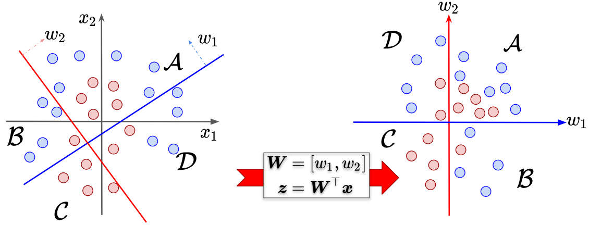
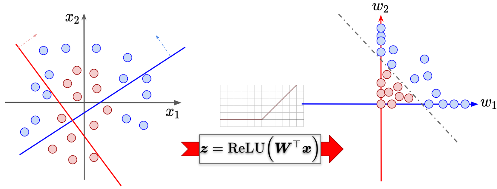
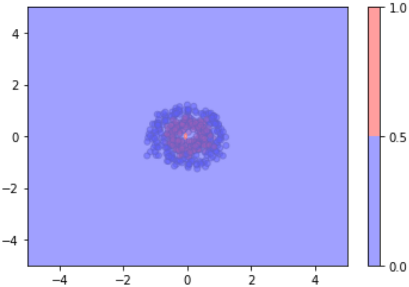
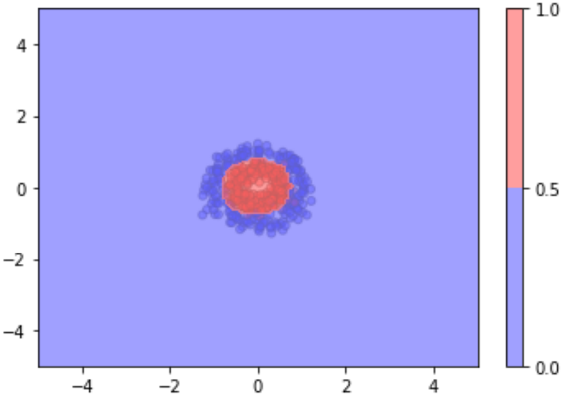
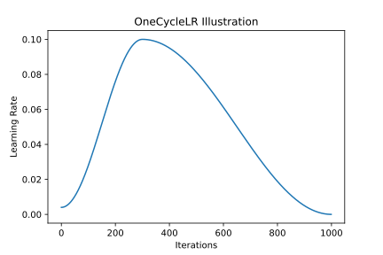
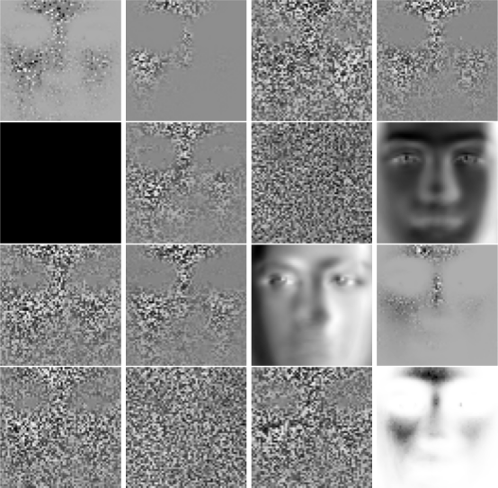
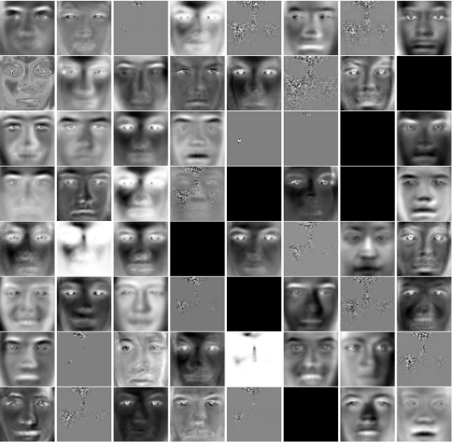

# Introduction

Let's clear up some things about machine learning. __*Machine learning is nothing but a combination of beautiful math and programming.*__

Why did I pour more effort into this university unit compared to my final year project (FYP)? I did this because while I had managed to [train and deploy models like YOLOv4 onto a robot](https://github.com/evantancy/ece4078-team2-05), or was [diving deep with reward shaping for my FYP](https://github.com/evantancy/CrowdNav_DSRNN), __machine learning__ felt like a big black box that I place data and train something to output some numbers. _What was I training? What was the training process? What did the numbers mean?_ I'm pretty happy I put more time into this unit and finished off strong with [a group project with reinforcement learning.](/projects/deep-rl-intelligent-traffic-management/index)

This module primarily focused on convolutional neural networks (CNNs), which was pretty fascinating given my interest in computer vision and my past internship with [AIDrivers](https://www.aidrivers.ai/) where I used instance segmentation for a project.

# Pipeline

Machine learning requires data. __A lot of it.__ These come in the form of labelled or un-labelled data. Certain features are created from the data as input features for a model. At the start, the weights of the model are initialized. During training, the model weights are being optimized using backpropagation and gradient descent, which provides a magnitude and direction to update the weights in a way that minimizes the _loss_ i.e. the difference between a model's prediction and the ground truth of the input data.

The model iteratively learns the data by reducing the difference between its predictions and the true label. with randomly initialized predicts the class of the input and the loss is some difference between the true label and predicted label.

# Linear Models

In the following equations, $ \hat{y} = w^{T}x_i $ refers to the _model's prediction based on some input x at index i_.

## Linear Regression

The loss function for linear regression is stated below, where $\sigma$ represents the sigmoid function, and $\hat{y}$ represents the model's prediction.

$$ \mathcal{L}_{SE}=\frac{1}{m}\sum_{i=1}^{N}(\hat{y}-y_{i})^{2}, \text{where w = weights and b = biases}$$

This is also known as the Least Squares Error (LSE) as it calculates the squared error between each data point and the model's prediction.

## Logistic Regression

The loss function for logistic regression is as follows.

$$ \mathcal{L}(\hat{y},y)=-ylog(\hat{y})-(1-y)log(1-\hat{y}) $$

$$ \mathcal{L}(\hat{y},y)=-ylog(\sigma(w^{T}x)-(1-y)log(1-\sigma(w^{T}x)) $$

Both linear & logistic regression are used in binary classification problems, where the logistic model's prediction of $\hat{y}=0.2$ represents an estimate for $P(y=0)=0.8$ and $P(y=1)=0.2$.

# Modelling Space & Feature Engineering

What is the purpose of activation functions or non-linear functions? Say we have the following features $ x_1, x_2 $ and weights $ \mathcal{W} = [w_1, w_2] $. By multiplying the features by the model weights, there is some linear transformation of the feature space. However, it is impossible to separate the features __without any nonlinear function__, as seen by the different coloured circles in first image below.

<figure>
    
    <figcaption class="caption">Data is not linearly separable</figcaption>
</figure>

<figure>
    
    <figcaption class="caption">Linearly separable data after transformation</figcaption>
</figure>

However, by applying some non-linear activation function, in particular the Rectified Linear Unit (ReLU) function, transformation of the feature space allows the data to be separated by some boundary.

This was also seen in [my first assignment](https://github.com/evantancy/ece4179/blob/main/assignments/assignment_1/hw1.ipynb), where given some data with features $x_1, and x_2$ and using the recommended 5D feature space mapping from $ \mathbb{R}^2=(x_1, x_2)^T to \mathbb{R}^5=(x_1, x_2, x_1^2, x_2^2, x_{1}x_{2})^T $ achieves poor model performance of 47.0% but by adding an additional dimension (bias) to the feature space (making it 6D) the parameter allows the dimensions of the ellipsoid to change and achieves 93.5% accuracy.

<div>
<figure>
    
    <figcaption class="caption">5D feature space, <b>47% accuracy</b></figcaption>
</figure>

<figure>
    
    <figcaption class="caption">6D feature space, <b>93.5% accuracy</b></figcaption>
</figure>
</div>


# Activation Functions

There are [many activation functions available here](https://pytorch.org/docs/stable/nn.html#non-linear-activations-weighted-sum-nonlinearity) in PyTorch, but personally I have mostly used Rectified Linear Unit (ReLU), LeakyReLU, Tanh as well as implemented the simple Sigmoid function.

When performing _computer vision_ based tasks, ReLU is typically used and is quite effective but it suffers from the __Dying ReLU problem__ whereby all negative inputs to the function output __zero__ and the neurons are basically dead. LeakyReLU combats this problem using a small factor, typically 0.01, so there is some small non-zero gradient. However, this does not mean that LeakyReLU is superior to plain ReLU and results may vary depending on the problem.

In deep reinforcement learning, I've come across Tanh activation functions which were used for both Recurrent Neural Networks (RNNs) and Multi-Layer Perceptron (MLP) networks. Perhaps this could be due to the Tanh function being centered at 0 whereas ReLU isn't. Additionally, Tanh outputs are in the range [-1,1] whereas that of ReLU is in [0,1].

# Hyperparameters

## Learning Rate
If learning rate (LR) is too high, the model may converge but overshoot beyond the point of optimality. If learning rate is too low, the model might not converge at all.

## Schedulers
Learning rate is quite annoying to tune and several runs need to be performed in order to find the __ideal learning rate__, but what if the ideal learning rate exists in a range instead of being a singular value?  proposes the use of _cyclical learning rates_, where instead of trying to pinpoint a specific lr, a lower and upper bound should be specified with parameters to determine the scheduler's increment/decay over time.

<figure>
    
    <figcaption class="caption">OneCycleLR learning rate over time</figcaption>
</figure>

The example above has an initial lr of 0.004, maximum lr of 0.1, with a ramp-up period of 300 out of 1000 iterations. The ramp-up iterations act as warm-up iterations, during the initial stage where lr increases. This benefits training by reducing any bias from data seen earlier by the model.

Check out Leslie's [presentation video.](https://www.youtube.com/watch?v=bR7z2MA0p-o)

# Convolutional Neural Networks (CNNs)

Traditionally in computer vision, kernels which are patches of $n$ x $n$ pixels slide over the image in order to detect corners, edges, features, or blur the image, etc and each kernel value had to be manually set. CNNs turn traditionally fixed kernel values into learnable parameters and allow for multiple feature maps. Anybody can head to the PyTorch / TensorFlow tutorial and easily stich a CNN together, _but what do these CNN layers output?_

## CNN Layer Output Visualized

When training a simple AutoEncoder with the architecture below, where __N=16__ or __N=64__
```
        input features
        |
        fc1 (4096,N)
        |
        ReLU
        |
        fc2 (N, 4096)
```

<figure>
    
    <figcaption class="caption">N=16, fc1 layer output visualized</figcaption>
</figure>

<figure>
    
    <figcaption class="caption">N=64, fc1 layer output visualized</figcaption>
</figure>

This very closely resembers eigenfaces during human face recognition, and it is pretty cool to see many more variations modelled in the larger model, which shows that a larger model has more model capacity or representational power.

## Occlusion Sensitivity Study

After training a custom neural network for the [STL dataset](https://cs.stanford.edu/~acoates/stl10/), I studied the effect of __removing certain patches of pixels__ as done by  in order to visualize the effect of removing certain pixels on a model's predictions.

Below a kernel of size 2 x 2 and a stride of 2 was used, and the top 5 predictions for each class were selected. While each colorbar's prediction score is minisclue in difference, it's interesting to see that removing pixels in the background that are on the edge of the objects leads to lower prediction scores. By using a small kernel, the outputs don't show anything significant.

Furthermore, by increasing the kernel size to 8 x 8 and stride to 8 there is no visible difference between the feature patches which allow the model to correctly predict the class of the objects.

<figure>
    
    <figcaption class="caption">Occlusion with kernel size 2 x 2 and stride 2</figcaption>
</figure>

<br>

<figure>
    
    <figcaption class="caption">Occlusion with kernel size 8 x 8 and stride 8</figcaption>
</figure>

# Random Notes
## A General Equation
Leslie Smith in his presentation video, proposes a general equation to balance for machine learning.

$$ \frac{\text{learning rate} * \text{weight decay}} {\text{batch size} * (1-\text{momentum})}=k, \text{where k is a constant}  $$
